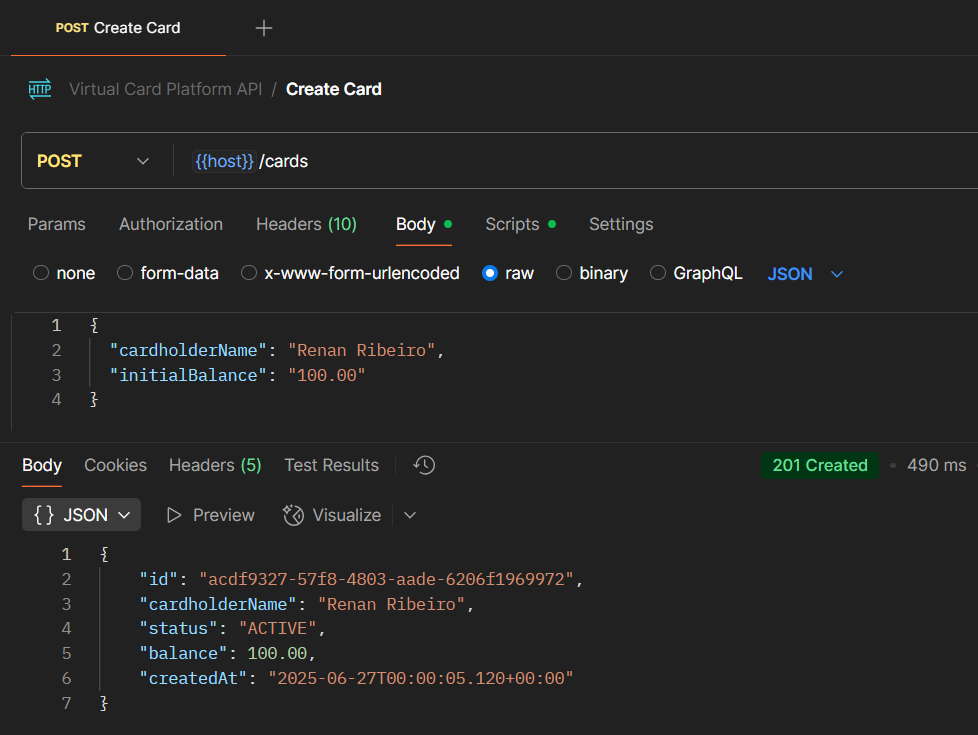
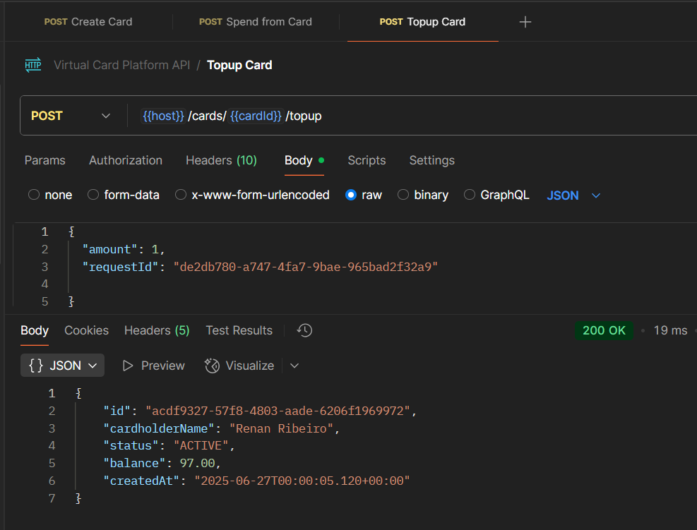
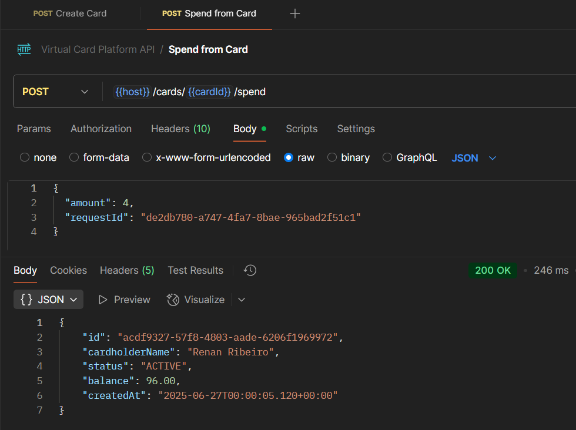
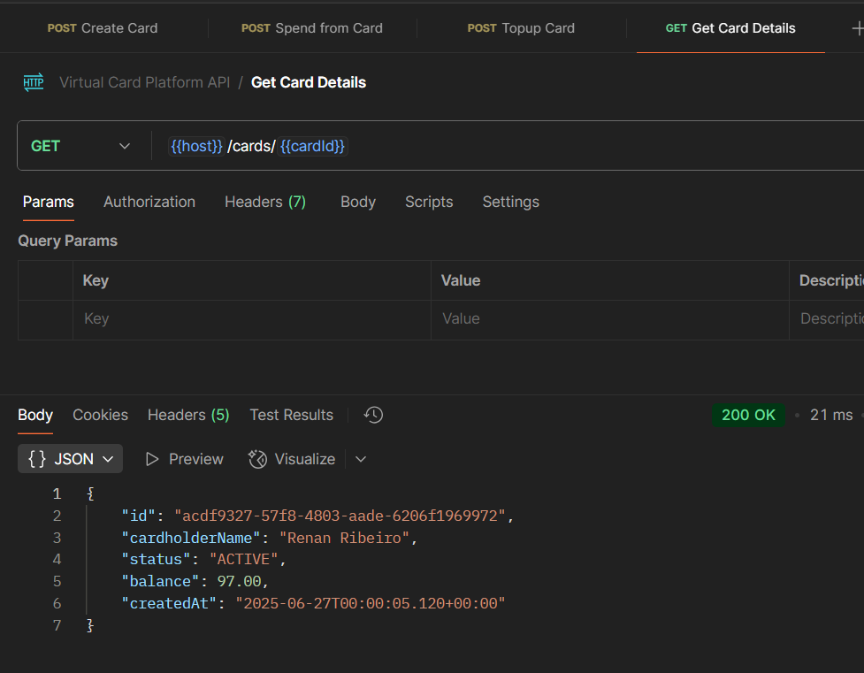
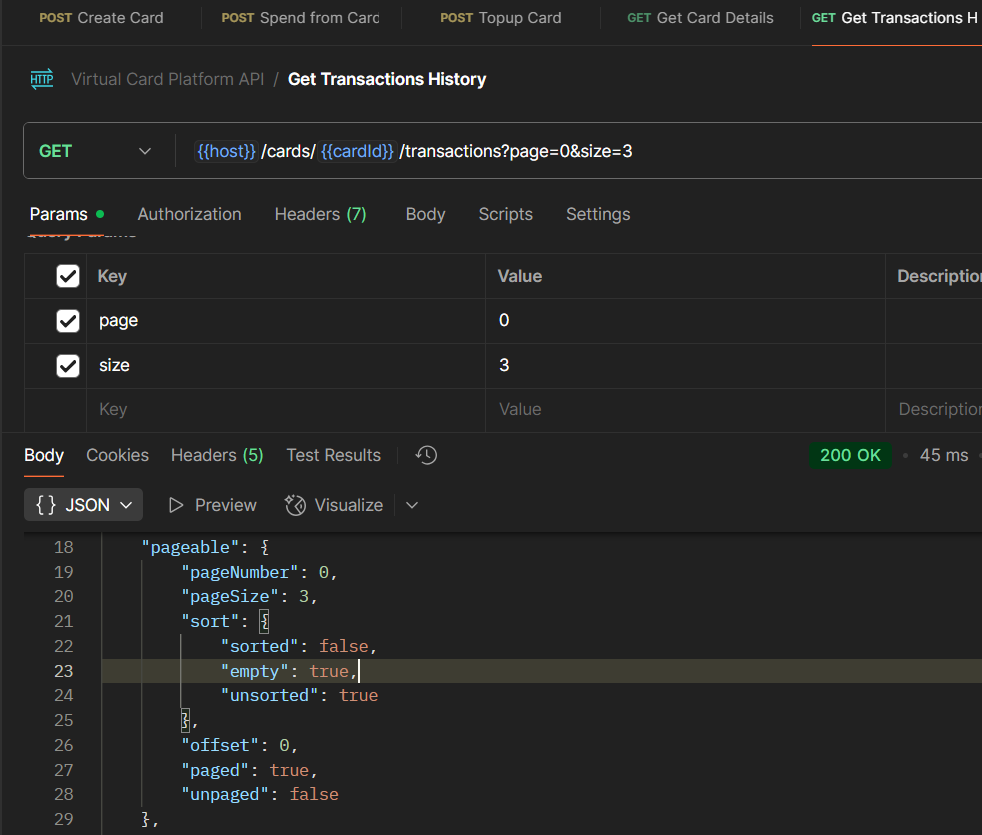

# 🎫 Virtual Card Platform - Backend API

<details>
  <summary><strong><span style="font-size: 1.1em;">
    💼 Problem Overview
  </span></strong></summary>

  <br>

  You are tasked with building the backend API for a **Virtual Card Platform**. Users should be able to:
  
  - Create virtual cards
  - Add funds (top-up)
  - Spend funds from the cards
  
  The system must guarantee **data consistency**, **prevent overspending**, and remain **robust under concurrent usage**.
  
  ---

</details>

<details>
  <summary><strong><span style="font-size: 1.1em;">
    🧱 Core Requirements
  </span></strong></summary>

  ##### 🏛️ Entity

  - 💳 Card 

    The Card entity represents a virtual card created by a user within the platform. It holds key information required for performing financial transactions, such as the available balance and operational status.
    
    - `id: UUID`
    - `cardholderName: String`
    - `balance: BigDecimal`
    - `createdAt: Timestamp`
  
  - 💸 Transaction

    The Transaction entity represents a financial operation executed on a virtual card. It stores information about the transaction type, amount, and the moment it occurred. Every transaction is linked to a specific card.
    
    - `id: UUID`
    - `cardId: UUID` (foreign key)
    - `type: ENUM { SPEND, TOPUP }`
    - `amount: BigDecimal`
    - `createdAt: Timestamp`

  ##### 🔌 API Endpoints
  
  - `POST /cards`
  
    - Creates a new virtual card.
    
    ```json
    {
      "cardholderName": "Alice",
      "initialBalance": 100.00
    }
    ```
  
  - `POST /cards/{id}/spend`
   
    - Returns `400 Bad Request` if balance is insufficient.
    - Must prevent double-spending via race condition handling.
    
    ```json
    {
      "amount": 30.00,
      "requestId": "UUID"
    }
    ```
  
  - `POST /cards/{id}/topup`
  
    - Adds funds to an existing card.
    
    ```json
    {
      "amount": 50.00,
      "requestId": "UUID"
    }
    ```
  
  - `GET /cards/{id}`
  
    - Retrieves card details including current balance.
    
  - `GET /cards/{id}/transactions`
    
    - Returns the full transaction history for a card.
    
  ---

</details>

<details>
  <summary><strong><span style="font-size: 1.1em;">
    📝 Business Rules
  </span></strong></summary>

  <br>

  - A card's balance **can never go below zero**
  - Transactions must ensure **atomicity and consistency** (e.g., no double spend)
  - Spending from **non-existent or deleted cards** is forbidden
  - Transactions are blocked if the card is `BLOCKED`
  - Cards must exist; otherwise, return `404 Not Found`
  - A card can have a **maximum of 5 SPEND transactions per minute**
  - Duplicate transactions are avoided by checking amount and timestamp within a configurable time window
  
  ---

</details>

<details>
  <summary><strong><span style="font-size: 1.1em;">
    🛠️ Setup Essentials
  </span></strong></summary>

  <br>

  - **Java 17** – Required language version
  - **Maven 3.8** – Dependency management and build tool
  - **Default port: 8080**

---

</details>


<details>
  <summary><strong><span style="font-size: 1.1em;">
    ▶️ How to Run
  </span></strong></summary>

  <br>

  ```bash
    mvn spring-boot:run
  ```

  > 📌 That's it! No additional configuration is needed. All dependencies are resolved via Maven.
  > 
  > 🚀 The application runs with:
  > - In-memory H2 database initialized via Flyway
  > - In-memory cache for improved performance and reduced database load

---

</details>

<details>
  <summary>
    📬 API Usage via Postman
  </summary>

  This project includes a complete [Postman collection](https://github.com/rhribeiro25/virtual-card-platform/blob/main/src/main/resources/static/docs/virtual-card-platform.postman_collection.json) to help test and explore the API.
  
  To use it:
  
  1. Import the collection into Postman  
  2. Run the application using:
  
     ```bash
     mvn spring-boot:run
     ```
  
  3. Execute the requests in the recommended order:
  </details>
  ---
  
  ### 🟢 `POST /cards` – Create a Virtual Card
  
  
  
  ---
  
  ### 🟡 `POST /cards/{id}/topup` – Add Funds to a Card
  
  
  
  ---
  
  ### 🔴 `POST /cards/{id}/spend` – Spend from the Card
  
  
  
  ---
  
  ### 🔍 `GET /cards/{id}` – Retrieve Card Details
  
  
  
  ---
  
  ### 📜 `GET /cards/{id}/transactions` – List Transactions
  
  

---

</details> 

<details>
  <summary>## ⚙ Implementations</summary>

- In-memory **H2 database** with versioning via **Flyway**

- **Spring Data JPA**

- In-memory **cache** using `@Cacheable` and `@CacheEvict`

- 100% **test coverage** (unit and integration) with **JUnit + Mockito**

- **Jacoco** test coverage report published via GitHub Pages:

  👉 [Test Coverage Report](https://rhribeiro25.github.io/virtual-card-platform)

- **Swagger UI** available for REST API exploration:

  👉 [Swagger Interface (localhost)](http://localhost:8080/swagger-ui.html)

- **Postman Collection** for manual testing:

  👉 [Access the file](https://github.com/rhribeiro25/virtual-card-platform/blob/main/src/main/resources/static/docs/virtual-card-platform.postman_collection.json)

- H2 database accessible during execution:

  👉 [H2 Console](http://localhost:8080/h2-console)
> JDBC URL: `jdbc:h2:mem:virtual_card_platform`\
> User: `sa` | Password: `123456`

- Transaction safety using `@Transactional` and **optimistic locking** via `@Version`

- Proper layering: `Controller → Service (UseCase) → Repository`

- Use of **DTOs**, **MapStruct-like mappers**, and REST best practices (HTTP 200, 201, 400, 404, 409, 500)

- Design patterns:

  - **Template Method** for transaction execution
  - **Facade** via `CardUsecase` to encapsulate logic
  - **Builder** for creating immutable entities

---

</details>

<details>
  <summary>## 🌟 Bonus Implementations</summary>

- Pagination support in transaction history
- Card status (`ACTIVE`, `BLOCKED`) with enforcement
- Version field (`@Version`) to enable optimistic concurrency
- Rate limiting: max 5 `SPEND` transactions/minute/card
- Swagger API documentation
- Caching to avoid repeated queries
- CI pipeline with **GitHub Actions** (build, test, Jacoco publish)
- **Flyway** DB versioning for environment consistency
- Request ID Validation – I added validation using requestId in transactions to make sure the same transaction isn't processed more than once, even in case of network issues or retries.
- Cache First Strategy – Now the system checks the cache first, and only goes to the database if the data isn’t there. That helps improve performance and reduce unnecessary DB hits.
- Global Exception Handler Improvements – I standardized internal error messages and improved how I handle exceptions, organizing everything through BusinessException to keep things clean and centralized.
- Transactional Rollback – I applied @Transactional(rollbackFor = BusinessException.class) to ensure that if anything goes wrong in a business rule, all operations inside the process are rolled back, even those inside a Template Method flow.
- Custom Validation per Transaction Type – I made validations customizable using a supports() method, so each one is only applied to the right type of transaction. It makes the system more flexible and easier to maintain.

---

</details>

<details>
  <summary>🧠 Technical Design Decisions</summary>

### `Transaction` linked directly to `Card` entity:

Using a rich domain model with full `Card` object instead of just `cardId` enables:

- Referential integrity and cascaded validations
- Easy access to card status and metadata
- Easier extension for rules based on card state

> This design improves expressiveness and consistency without violating business constraints.

---

</details>

<details>
  <summary>## ⚖ Trade-offs</summary>

- Security (e.g., JWT) not implemented to focus on core logic
- H2 in-memory DB used for speed and ease of local testing
</details>
---

<details>
  <summary>## 🚀 Future Improvements</summary>

- JWT authentication via Spring Security
- Redis cache for horizontal scalability
- PostgreSQL + Docker Compose setup
- Kafka for event-driven architecture
- API Gateway and circuit breakers
- Cloud deployment with monitoring and alerting
- Observability with structured logs and tracing support (ELK, OpenTelemetry, Grafana-ready)

---

</details>

<details>
  <summary>## 📙 Learning Strategy</summary>

- Practical development with hands-on debugging
- Official documentation as a primary reference
- Courses and online resources for frameworks and architecture

---

</details>

> Developed by Renan Henrique Ribeiro\
> [LinkedIn](https://www.linkedin.com/in/rhribeiro25)

