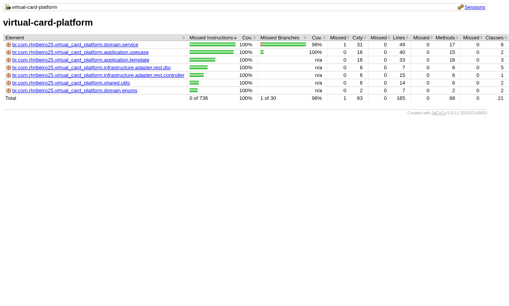

# 🎫 Virtual Card Platform

<details>
  <summary><strong><span style="font-size: 1.1em;">
    💼 Problem Overview
  </span></strong></summary>

  <br>

You are tasked with building the backend API for a **Virtual Card Platform**. Users should be able to:

- Create virtual cards
- Add funds (top-up)
- Spend funds from the cards

The system must guarantee **data consistency**, **prevent overspending**, and remain **robust under concurrent usage**.

#

</details>

<details>
  <summary><strong><span style="font-size: 1.1em;">
    🧱 Core Requirements
  </span></strong></summary>

##### 🏛️ Entity

- 💳 Card

  The Card entity represents a virtual card created by a user within the platform. It holds key information required for performing financial transactions, such as the available balance and operational status.

    - `id: UUID`
    - `cardholderName: String`
    - `balance: BigDecimal`
    - `createdAt: Timestamp`

- 💸 Transaction

  The Transaction entity represents a financial operation executed on a virtual card. It stores information about the transaction type, amount, and the moment it occurred. Every transaction is linked to a specific card.

    - `id: UUID`
    - `cardId: UUID` (foreign key)
    - `type: ENUM { SPEND, TOPUP }`
    - `amount: BigDecimal`
    - `createdAt: Timestamp`

##### 🔌 API Endpoints

- `POST /cards`

    - Creates a new virtual card.

  ```json
  {
    "cardholderName": "Alice",
    "initialBalance": 100.00
  }
  ```

- `POST /cards/{id}/spend`

    - Returns `400 Bad Request` if balance is insufficient.
    - Must prevent double-spending via race condition handling.

  ```json
  {
    "amount": 30.00,
    "requestId": "UUID"
  }
  ```

- `POST /cards/{id}/topup`

    - Adds funds to an existing card.

  ```json
  {
    "amount": 50.00,
    "requestId": "UUID"
  }
  ```

- `GET /cards/{id}`

    - Retrieves card details including current balance.

- `GET /cards/{id}/transactions`

    - Returns the full transaction history for a card.

#

</details>

<details>
  <summary><strong><span style="font-size: 1.1em;">
    📝 Business Rules
  </span></strong></summary>

  <br>

- A card's balance **can never go below zero**
- Transactions must ensure **atomicity and consistency** (e.g., no double spend)
- Spending from **non-existent or deleted cards** is forbidden
- Transactions are blocked if the card is `BLOCKED`
- Cards must exist; otherwise, return `404 Not Found`
- A card can have a **maximum of 5 SPEND transactions per minute**
- Duplicate transactions are avoided by checking amount and timestamp within a configurable time window

#

</details>

<details>
  <summary><strong><span style="font-size: 1.1em;">
    🧩 Sequence Diagrams
  </span></strong></summary>

<br>

This section presents the key backend flows through sequence diagrams, covering both successful and failure scenarios for each API endpoint.

> Diagrams are generated with PlantUML and stored under `src/main/resources/static/docs/diagrams/`.

#


###### ✅ Create Card – Success


#


###### ❌ Create Card – Errors


#

###### ✅ Get Card – Success


#

###### ❌ Get Card – Errors


#

###### ✅ Get Transactions – Success


#

###### ❌ Get Transactions – Errors


#

###### ✅ Spend Card – Success


#

###### ❌ Spend Card – Errors


#

###### ✅ Top-Up Card – Success


#

###### ❌ Top-Up Card – Errors


#

</details>

<details>
  <summary><strong><span style="font-size: 1.1em;">
    🛠️ Setup Essentials
  </span></strong></summary>

  <br>

- **Java 17** – Required language version
- **Maven 3.8** – Dependency management and build tool
- **Default port: 8080**

#

</details>

<details>
  <summary><strong><span style="font-size: 1.1em;">🐳 Containerization with Docker</span></strong></summary>

###### 📦 Docker Overview

This project provides a ready-to-use Docker setup to build and run the application in a containerized environment. Docker ensures consistency across environments and simplifies both local development and deployment.

#

###### 🛠️ Build the Docker Image

To build the Docker image locally:

```bash
docker build -t virtual-card-platform .
```

This uses the `Dockerfile` located at the project root, which builds the Spring Boot application and packages it into a minimal runtime image.


#

</details>


<details>
  <summary><strong><span style="font-size: 1.1em;">
    ▶️ How to Run
  </span></strong></summary>


###### 🐳 Run using Docker container

To run the application with a specific Spring profile (`dev`, `hml`, or `prd`):

```bash
docker run --rm -it -e SPRING_PROFILES_ACTIVE=dev -p 8080:8080 virtual-card-platform
```

- `--rm`: automatically removes the container after stopping.
- `-it`: interactive terminal mode (logs appear in your console).
- `-e SPRING_PROFILES_ACTIVE=dev`: defines the Spring Boot environment.
- `-p 8080:8080`: maps container port 8080 to host port 8080.

#

###### 📦 Run using Maven

  ```bash
    mvn spring-boot:run
  ```

> 📌 That's it! No additional configuration is needed. All dependencies are resolved via Maven.
>
> 🚀 The application runs with:
> - In-memory H2 database initialized via Flyway
> - In-memory cache for improved performance and reduced database load

#

</details>

<details>
  <summary><strong><span style="font-size: 1.1em;">
    📬 API Usage via Postman
  </span></strong></summary>

  <br>

This project includes a complete [Postman collection](https://github.com/rhribeiro25/virtual-card-platform/blob/main/src/main/resources/static/docs/virtual-card-platform.postman_collection.json) to help test and explore the API.

1. Import the collection into Postman
2. Run the application using:
3. Execute the requests in the following order:

###### 💳 `POST /cards` – Create a Virtual Card


###### 💸 `POST /cards/{id}/topup` – Add Funds to a Card


###### 💸  `POST /cards/{id}/spend` – Spend from the Card


###### 🔍 `GET /cards/{id}` – Retrieve Card Details


###### 📜 `GET /cards/{id}/transactions` – List Transactions


###### 🌐 API Access Guide

> 💡 **Accessing the API**
>
> If you are running the application **locally**, use the following HOST:  
> `http://localhost:8080`
>
> If you want to access the deployed application via **Heroku**, use one of the following URLs based on the environment:
>
> - **Development Environment HOST:**  
    >   `https://virtual-card-platform-dev-7c9a917ba5c1.herokuapp.com`
>
> - **Staging environment HOST:**  
    >   `https://virtual-card-platform-hml-a00fc4bcb4b4.herokuapp.com`
>
> - **Production Environment HOST:**  
    >   `https://virtual-card-platform-prd-36e5f3160255.herokuapp.com`

#

</details> 


<details>
  <summary><strong><span style="font-size: 1.1em;">
    🌐 API Usage via Swagger UI
  </span></strong></summary>

<br>

This project includes **Swagger UI** to help developers explore and test the available endpoints.

| Environment               | Swagger URL                                                                                               |
|---------------------------|-----------------------------------------------------------------------------------------------------------|
| 🖥️ Local                  | [virtual-card-platform-dev](http://localhost:8080/swagger-ui.html)                          |
| 🧪 Development            | [virtual-card-platform-dev](https://virtual-card-platform-dev-7c9a917ba5c1.herokuapp.com/swagger-ui.html) |
| 🚧 Staging (Homologation) | [virtual-card-platform-hml](https://virtual-card-platform-hml-a00fc4bcb4b4.herokuapp.com/swagger-ui.html) |
| ✅ Production              | [virtual-card-platform-prd](https://virtual-card-platform-prd-36e5f3160255.herokuapp.com/swagger-ui.html) |


#

</details>


<details>
  <summary><strong><span style="font-size: 1.1em;">
    🧪 Code Test Coverage
  </span></strong></summary>

- **Jacoco** test coverage report published via GitHub Pages:

  [](https://rhribeiro25.github.io/virtual-card-platform)

#

</details>

<details>
  <summary><strong><span style="font-size: 1.1em;">
    🔄 Release Management and DevOps
  </span></strong></summary>

<br>
To ensure a smooth and reliable development cycle, we follow best practices for version control, Continuous Integration (CI), and Continuous Delivery (CD).

##### 📌 Development Flow

1. Finish your task locally.
2. Create a new branch:
   ```bash
   git checkout -b "feature/task-name"
   ```
3. Add and commit your changes:
   ```bash
   git add .
   git commit -m "feat: task description"
   ```
4. Push the branch:
   ```bash
   git push origin "feature/task-name"
   ```
5. Open a Pull Request (via GitHub or CLI):
   ```bash
   gh pr create --base main --head feature/task-name --title "feat: description" --body "Implementation details"
   ```

6. After **two approvals**, the Pull Request is merged into the `main` branch.

#

##### 🏷️ Version Tagging

After the `main` branch is updated, a new version of the system is tagged using Git:

```bash
git checkout main
git pull origin main
git tag vX.X.X
git push origin vX.X.X
```

> 🎯 This triggers the **CI pipeline**, which builds, tests, and packages the application.

#

##### 🚚 Promotion to Environments (CD)

With the image generated by the tag, you can promote the version to different environments using the **manual CD pipeline**, which allows you to select:

- Version (tag)
- Target environment (`dev`, `hml`, or `prd`)

> 🧠 **Note:** If the release **does not exist**, it will be **automatically created** during the first deployment to the `dev` environment. This ensures consistency throughout the promotion cycle.

> ✅ After deployment to `dev`, the same version can be promoted to `hml` and `prd` manually without rebuilding.

#

</details>

<details>
  <summary><strong><span style="font-size: 1.1em;">
    ⚙ Implementations
  </span></strong></summary>

- In-memory **H2 database** with versioning via **Flyway**

- **Spring Data JPA**

- In-memory **cache** using `@Cacheable` and `@CacheEvict`

- 100% **test coverage** (unit and integration) with **JUnit + Mockito**

- Transaction safety using `@Transactional` and **optimistic locking** via `@Version`

- Proper layering: `Controller → Service (UseCase) → Repository`

- Use of **DTOs**, **MapStruct-like mappers**, and REST best practices (HTTP 200, 201, 400, 404, 409, 500)

- Design patterns:
    - **Template Method** for transaction execution
    - **Facade** via `CardUsecase` to encapsulate logic
    - **Builder** for creating immutable entities

- **Swagger UI** available for REST API exploration:

  👉 [Swagger Interface (localhost)](http://localhost:8080/swagger-ui.html)

- H2 database accessible during execution:

  👉 [H2 Console](http://localhost:8080/h2-console)

  <br>

> JDBC URL: `jdbc:h2:mem:virtual_card_platform`\
> User: `sa` | Password: `123456`

#

</details>

<details>
  <summary><strong><span style="font-size: 1.1em;">
    🌟 Bonus Implementations
  </span></strong></summary>

  <br>

- Pagination support in transaction history
- Card status (`ACTIVE`, `BLOCKED`) with enforcement
- Version field (`@Version`) to enable optimistic concurrency
- Rate limiting: max 5 `SPEND` transactions/minute/card
- Swagger API documentation
- Caching to avoid repeated queries
- CI pipeline with **GitHub Actions** (build, test, Jacoco publish)
- **Flyway** DB versioning for environment consistency
- Request ID Validation – validation using requestId in transactions to make sure the same transaction isn't processed more than once, even in case of network issues or retries.
- Cache First Strategy – Now the system checks the cache first, and only goes to the database if the data isn’t there. That helps improve performance and reduce unnecessary DB hits.
- Global Exception Handler – organizing everything through BusinessException to keep things clean and centralized.
- Transactional Rollback – @Transactional(rollbackFor = BusinessException.class) to ensure that if anything goes wrong in a business rule, all operations inside the process are rolled back, even those inside a Template Method flow.
- Custom Validation per Transaction Type – validations customizable using a supports() method, so each one is only applied to the right type of transaction. It makes the system more flexible and easier to maintain.

#

</details>

<details>
  <summary><strong><span style="font-size: 1.1em;">
    🧠 Technical Design Decisions
  </span></strong></summary>

  <br>

Using a rich domain model with full `Card` object instead of just `cardId` enables:

- Referential integrity and cascaded validations
- Easy access to card status and metadata
- Easier extension for rules based on card state

  <br>

> This design improves expressiveness and consistency without violating business constraints.

#

</details>

<details>
  <summary><strong><span style="font-size: 1.1em;">
    ⚖ Trade-offs
  </span></strong></summary>

1. Simplified Domain Models (Card & Transaction only)

   **Trade-off:**  
   Limited modeling to only two main entities (`Card` and `Transaction`) to keep the codebase small and testable.

   **Impact:**  
   ✅ Keeps business logic focused and isolated  
   ❌ May require refactoring when introducing related domains (e.g., User, Limits, Notifications)

2. Synchronous REST-only Communication

   **Trade-off:**  
   Used only REST APIs for card operations.

   **Impact:**  
   ✅ Easy to implement and test  
   ❌ Not scalable for high-throughput or event-driven scenarios (e.g., Kafka-based processing)

3. Optimistic Locking Instead of Distributed Locking

   **Trade-off:**  
   Used `@Version` field for concurrency handling instead of distributed locks (e.g., Redis-based).

   **Impact:**  
   ✅ Simple and safe within a single DB instance  
   ❌ May not prevent race conditions in distributed, high-concurrency environments

4. In-memory Cache Instead of Redis

   **Trade-off:**  
   Used `@Cacheable` with in-memory cache to reduce DB hits.

   **Impact:**  
   ✅ Zero setup; improves performance locally  
   ❌ Not suitable for horizontal scaling or shared cache between instances

5. Flyway for Versioning, No Liquibase or Schema Generation

   **Trade-off:**  
   Chose Flyway for database migrations and disabled Spring’s auto DDL generation.

   **Impact:**  
   ✅ Full control over schema changes, predictable  
   ❌ Requires manual script writing; no visual diffing or rollback tools built-in

6. Rate Limiting by Business Rule, Not Infrastructure

   **Trade-off:**  
   Implemented rate limiting (5 SPEND/min) in business logic instead of using an API Gateway or filter-based limiter.

   **Impact:**  
   ✅ Business-specific control  
   ❌ No automatic protection against DoS or broader abuse patterns

7. No Integration with External Services

   **Trade-off:**  
   The project is self-contained and doesn't simulate real external systems (e.g., card providers, fraud detection, etc.).

   **Impact:**  
   ✅ Simpler test scope  
   ❌ Less realistic for real-world systems with integration complexity

8. CI/CD with GitHub Actions but No Deployment Step

   **Trade-off:**  
   Configured automated tests and coverage reports, but deployment was not included.

   **Impact:**  
   ✅ Validates code quality early  
   ❌ Does not demonstrate production readiness (e.g., Docker, cloud deploy)

9. No Logging Framework Configured (e.g., SLF4J + Logback)

   **Trade-off:**  
   Relied on Spring Boot default logging without structuring log outputs.

   **Impact:**  
   ✅ Sufficient for local dev  
   ❌ Not prepared for observability or log analysis in production

#

</details>


<details>
  <summary><strong><span style="font-size: 1.1em;">
    🚀 Future Improvements
  </span></strong></summary>

1. <strong>Observability & Monitoring</strong>
    - Centralized logging with ELK stack (Elasticsearch, Logstash, Kibana)
    - Tracing with OpenTelemetry or Jaeger
    - Health checks via Spring Boot Actuator
    - Real-time metrics with Prometheus + Grafana
    - Alerting system (e.g., with Grafana Alerts or Google Cloud Monitoring)

2. <strong>Security</strong>
    - OAuth2 + JWT token support with Spring Security
    - JWE (JSON Web Encryption) for sensitive payload protection
    - Rate limiting via API Gateway or Bucket4j
    - CORS and CSRF protection setup
    - Secrets management with Vault or environment-level encryption

3. <strong>Persistence & Infrastructure</strong>
    - Replace H2 with PostgreSQL in Docker
    - Full Docker Compose environment (App + DB + Cache + Monitoring)
    - Migration scripts validation with Flyway dry-run
    - Testcontainers for integration tests with real databases

4. <strong>Testing & Quality</strong>
    - Integration tests using Testcontainers
    - Contract testing with Spring Cloud Contract
    - Load testing with k6 or Gatling
    - Mutation testing with Pitest
    - Code smells and static analysis with SonarQube

5. <strong>Performance & Scalability</strong>
    - Use Redis or Caffeine for distributed caching
    - Enable async processing with @Async or Spring Batch
    - Introduce rate limiting using external services (e.g., Kong, Envoy)
    - Adopt Circuit Breaker pattern (e.g., with Resilience4j)

6. <strong>Architecture & Organization</strong>
    - Modularization using Spring Modules / Multi-Module Maven
    - Use Clean Architecture + CQRS for command/query separation
    - Extract audit logic to a dedicated auditing module

7. <strong>Developer Experience</strong>
    - Swagger UI enhancements (tag groups, examples, auth header prefill)
    - Include Makefile or CLI script for common dev tasks
    - GitHub Actions with code coverage badge and changelog generator
    - Automatic changelog generation using Conventional Commits + Release Drafter

#

</details>

<details>
  <summary><strong><span style="font-size: 1.1em;">
    📙 Learning Strategy
  </span></strong></summary>

  <br>

- Practical development with hands-on debugging
- Official documentation as a primary reference
- Courses and online resources for frameworks and architecture

#

</details>

#

> Developed by Renan Henrique Ribeiro\
> [LinkedIn](https://www.linkedin.com/in/rhribeiro25)
